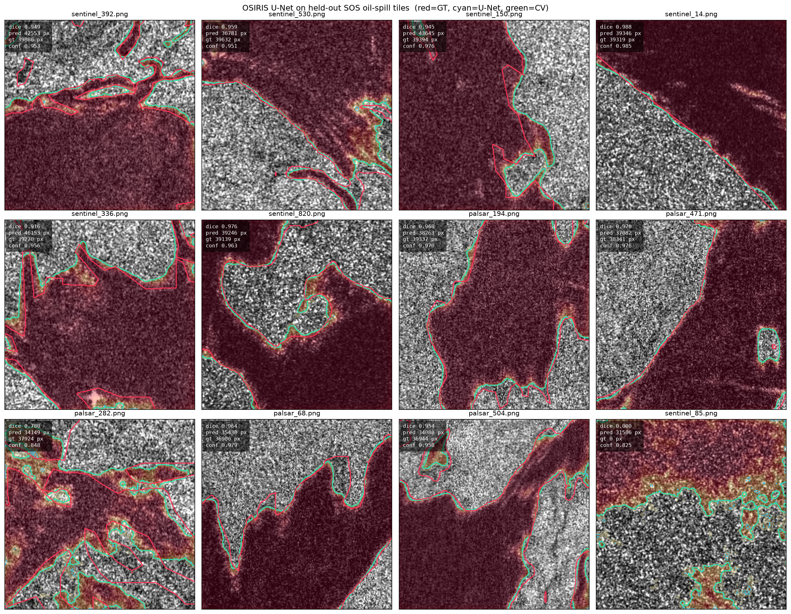
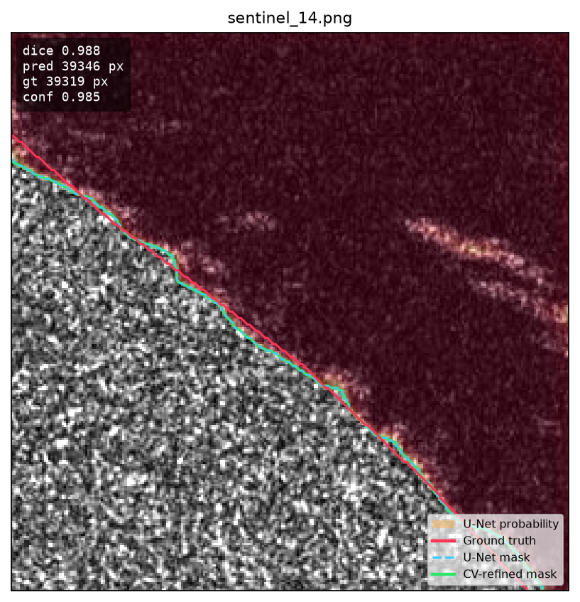
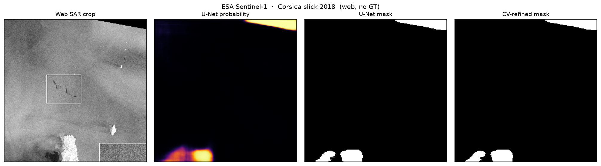

# OSIRIS

**Ocean Spill Intelligence & Response Intelligence System**

A Smart India Hackathon project on detecting oil on the sea from **satellite radar**, not from ordinary photographs.

When fuel or crude sits on water, it calms the small waves that Sentinel-1’s radar normally bounces off. On a SAR image that patch goes dark. OSIRIS is a first working cut at painting those patches automatically, then being honest about where that idea still fails.

This repository is the **perception** slice of OSIRIS: data, a small U-Net, a light classical cleanup, and the experiments we actually ran. Vessel tracking, drift, and a full response console are out of scope here.

---

## Why this problem is hard

Radar does not “see oil.” It sees **texture**. Oil, very calm wind, biogenic film, and some coastlines can all look like a dark smear. A model that only maximises overlap on easy, fat spills will look excellent in a gallery and still miss a thin real slick — or call empty water a disaster.

We trained on a public tile dataset, measured it properly, then took the same weights to a real ESA press image. The gap between those two tests is the finding, not a footnote.

---

## What we built

```
SAR tile → percentile stretch → U-Net (logits) → sigmoid
        → optional morphological cleanup → oil mask
```

| Piece | Choice |
|---|---|
| Data | Refined Deep-SAR SOS ([Zenodo 15298010](https://zenodo.org/records/15298010)) |
| Size | 8,070 pairs of 256×256 PNG (radar + mask) |
| Split | train 6,455 / val 807 / test 808 (official val folder split in half for test) |
| Model | U-Net, 3-channel in, 1-channel out, base width 32, depth 4 |
| Loss | 0.5 BCE + 0.5 Dice |
| Train | AdamW, lr 1e-3, batch 4, AMP, early stopping |
| Hardware | NVIDIA RTX 5060 Laptop (~8 GB), PyTorch CUDA 12.8 (`sm_120`) |
| Post-process | open / close / small-component removal (inference only) |

Training does **not** use AIS, wind, or full swaths. Those belong in a later OSIRIS stage.

A pairing bug was worth recording: SOS **reuses filenames** in `train/` and `val/` (for example `palsar_0.png` in both). Matching on stem alone mixed train images with val masks. Pairs are keyed by **split folder + stem**.

---

## Results

Held-out SOS (same distribution as training):

| Split | Dice | IoU |
|---|---|---|
| Validation (best checkpoint, epoch 19) | **0.830** | **0.722** |
| Test | ~0.830 | ~0.722 |

Training was capped at 50 epochs and **stopped early** around epoch 29. Best validation Dice was **0.830 at epoch 19**. A short self-critical RL pass on top of that checkpoint moved Dice from 0.830 to 0.832 — not a meaningful gain. We dropped RL from the codebase.

**In-distribution overlays** (red = ground truth, cyan = U-Net, green = CV cleanup):



On large, high-contrast spills the contours sit almost on top of the labels. Example, `sentinel_14` (Dice ≈ 0.99):



That gallery was **biased toward the largest oil regions** (~37k–40k oil pixels out of 65,536). High Dice there mostly means “fill the dark half of the tile.” It is not proof the network tracks thin filaments.

**Out-of-distribution:** Copernicus Sentinel-1 image of the October 2018 slick north of Corsica (ESA; contains modified Copernicus Sentinel data). We cropped the ocean, then — as the current pipeline still does — **resized the whole crop to 256×256**. The model did not follow the thin dark streak. It highlighted dark edges and land-like regions (~2.3k predicted pixels, mean confidence ~0.86). The white box on the source graphic is ESA’s annotation, not ours.



A held-out SOS tile with **no oil in the label** (`sentinel_85`) still drew a large high-confidence region. That is a lookalike false positive, not a scoring glitch.

Morphological cleanup rarely changed the U-Net mask. The network is doing the work; the CV stage is not a second detector.

---

## What we think this means

The model is a **reasonable SOS-tile segmenter**. It is not yet a wide-area spill scout.

Squashing a full scene to 256 pixels is unfair to a network that only ever saw 256 tiles. The next honest test is **sliding-window inference** at native scale, before any claim that “the architecture cannot generalise.”

SOS also under-represents **lookalikes and empty ocean as first-class classes**. Without those, Dice on oil-heavy tiles can rise while false alarms on calm water get worse.

We do not believe unsupervised pretraining is the bottleneck: 8,070 labelled tiles are enough to learn “dark blob.” Semi-supervised pseudo-labels on SAR are dangerous here because the model is already **confident when it is wrong**.

A more useful data mix is radar **plus** masks for oil, lookalike, and no-oil, preferably on scenes larger than 256×256 (for example the 2048×2048 Sentinel-1 set of Trujillo et al., *Marine Pollution Bulletin*, 2024). Keep SOS; add negatives and scale. Then judge **thin-slick recall and lookalike false-alarm rate**, not SOS Dice alone.

---

## Repository layout

```
configs/config.yaml     training and inference knobs
src/models/             U-Net, BCE+Dice
src/data/               loaders, SAR stretch, augmentations
src/training/           train / validate
src/inference/predict.py
src/cv/                 morphological cleanup
scripts/                held-out overlays and the ESA web test
docs/figures/           images used in this README
```

Weights, raw SOS tiles, and run logs stay local (see `.gitignore`). Checkpoints are about 23 MB each (`best.pt` / `last.pt`).

---

## Setup

Python 3.12. RTX 50-series needs a **CUDA 12.8** wheel.

```bash
python -m venv .venv
source .venv/bin/activate
pip install torch torchvision --index-url https://download.pytorch.org/whl/cu128
pip install -r requirements.txt
```

Place Refined SOS under `data/raw/refined_sos/{images,masks}/{train,val}` and split lists under `data/splits/{train,val,test}.txt` (tab-separated image path, mask path). Put `best.pt` in `checkpoints/`.

```bash
python src/training/train.py --config configs/config.yaml
python src/training/validate.py --config configs/config.yaml --checkpoint checkpoints/best.pt --split test
python src/inference/predict.py --image path/to/sar.png --config configs/config.yaml
```

Resume: `--resume checkpoints/last.pt`.

---

## Data and image credit

- SOS tiles: refined Deep-SAR Oil Spill data on [Zenodo](https://zenodo.org/records/15298010). Use and cite according to the record.
- Corsica figure: contains modified Copernicus Sentinel data (2018), processed by ESA.

---

Built for **Smart India Hackathon**. Numbers and failure cases are in the sections above.
